  

# Sereact 3D bounding Box Predictor

  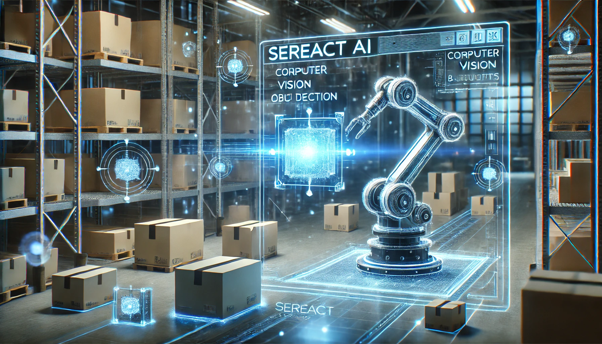 <br>


## Code Challenge Implementation

### Key Components:
- Data Analysis
- Data Preprocessing
- Model Architectures
- Performance Evaluation
- Suggestions
- Problems
  
### Required Packages: 
```
torch
timm
opencv
open3d
nvidia-cu12.8
matplotlib
wandb
numpy
```

## 1. Data Analysis

### Point Cloud: <br>
Based on my understanding, the point cloud data is organized in a structure similar to an image. Its shape is (3, height, width), where each pixel corresponds to a 3D point with X, Y, and Z coordinates.

It appears these point cloud and other data are generated by **simulation software** specifically for training model in test environment. 

**Channel Descriptions:**.

- X-axis: Measure **how far** a point from camera's center in the **horizontal direction** (left: negative, right: positive, center: zero)

- Y-axis: Measure **how far** a point from camera's center in the **vertical direction**. (above: negative, below: positive, center: zero)

- Z-axis: Depth distance from the camera, changing smoothly from top to bottom. it provides **per-pixel depth**. Objects **closer** to the camera have **smaller Z values**.  Objects **farther away** have **larger Z values**. <br>

**Visualization Command:**
```python
python visualizer/point_viz.py --file_path dataset/points/00001.npy
```

<br>
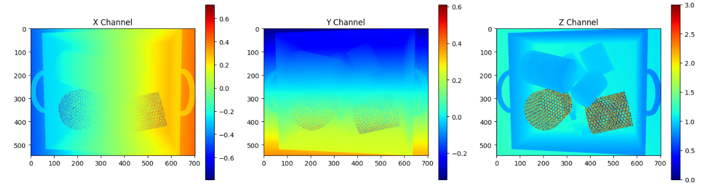 <br>

<br>

**3D boudning Boxes(Ground Truth) Visualization**<br>
3D bounding box represnts 8 corners, each having three values x, y, z. Its shape is (num_objects, 8, 3).

```python
python visualizer/open3d_viz.py --sample 859074c5-9915-11ee-9103-bbb8eae05561 --draw_3d_box
```

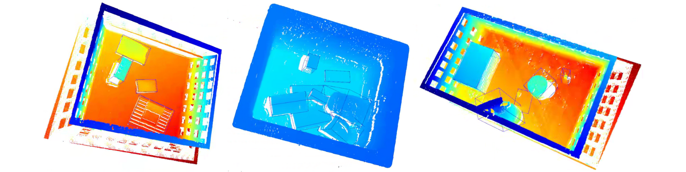 <br>

**Mask and generate 2D Bounding Boxes**.
```python
python visualizer/mask_2dbox_viz.py --image_path ./dataset/images/00026.jpg  --mask_path ./dataset/masks/00026.npy
```
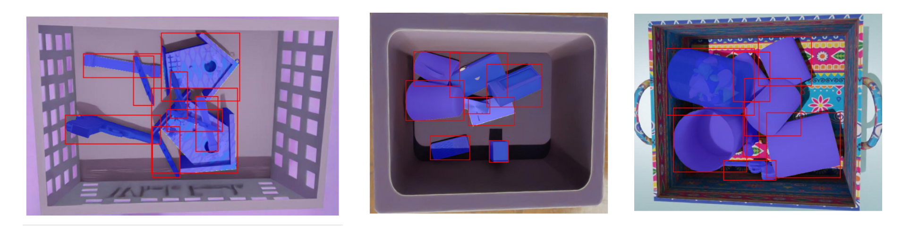 <br>


### 2. Data Preparation and Preprocessing

#### Dataset Restructuring

Restructuring raw data organizes it into a standardized format, making it easier to process and access.

**Command:**
```python
python prepare_dataset.py --input-path ./raw_data --output-path dataset 
```
**DATASET Structure**


    ```
    dataset/
    │── points/  
    │   ├── 00001.npy  
    │   ├── 00002.npy  
    │   ├── ...  
    │── masks/  
    │   ├── 00001.npy  
    │   ├── 00002.npy  
    │   ├── ...  
    │── bboxes_3d/  
    │   ├── 00001.npy  
    │   ├── 00002.npy  
    │   ├── ...  
    │── images/  
    │   ├── 00001.jpg  
    │   ├── 00002.jpg  
    │   ├── ...  

#### Preprocessing
* **Image (<em>ImageMaskTransforms</em>)**
    - Resizing to (224, 224)
    - Normalization (range [-1, 1])
    - To Tensor
    - Brightness augmentation
* **Point Cloud (<em>PointCloudTransforms</em>)**
    -  Reshape: Converts the points cloud from shape (3, H, W) to (N, 3 )for compatibility with the PointNet model or LiDAR-based model
     - Normalization
     - Voxelization
* **3D Boudning Box (<em>BBox3DTransforms</em>)**
    - Reshape: Convert 3D corners representation to centroid, size, orientation(reasoin for model part)
    - Boudning box parameterization: center_x, center_y, center_z, width, height, depth, yaw. its shape is (num_objects, 7)
    - To Tensor
    - Normalization

#### Data Loader
 - **Data Loading:** There are two dataloader such as the <em>**SereactDataLoader**</em>, <em>**PillarsDataLoader**</em> that loads images, point clouds, 3D bounding boxes with support for transformations on each data type.
  - **Data Splitting**: The <em>**DataSpliter**</em> class handles file loading, shuffling, and splitting the all data into training and testing sets. 


## Deep Learning Models
### 1. Point Cloud Based Model (PointPillars)

This model is implemented with the following features:

### Model Pipeline:
 - **Total Parameters: 4,830,140** 
 - **Input: Point Cloud** <br> 
    - Transform the organized point cloud into an unorganized format with shape (N, 3) to feed into the PointNet-based model
 - **Voxelization**<br>
  Converting 3D point cloud data into a grid of voxels to represent spatial information. The voxel values were specifically tuned for the Sereact dataset point ranges, which were achieved using this script.
    ```
    python utils/get_point_ranges.py
    ```
   - Voxel Size: **[0.01, 0.01, 0.01]** 
   - Point Cloud Range: **[-1.60, -1.35, 0.0, 1.60, 1.35, 3.0]**
   - Max Number Points: **32**
   - Max Voxels: **(30000, 50000)** <br>
    
    **Note**: the Voxels parameters adjusted by myself. 
 - **Pillar Feature Encoding:** <br>
    - Extract high-level features from each voxel/pillar using a PointNet based model<br>
     - Convert pillars features into densce pseude-images
  - **2D CNN Backbone**
     - Process the pseudo-image using 2D CNN layers
  - **SSD Detection Head**
    - Predict oriented 3D bounding boxes with the output structure  (x,y,z,w,l,h,θ)
    - Utilizes anchor-based regression
    - Anchors size: [
                [0.096, 0.096, 0.10], #  Small anchor <br>
                [0.153, 0.154, 0.15],  # Medium anchor<br>
                [0.21, 0.213, 0.21], # Large anchor<br>]
    - Anchors ranges: [[-1.60, -1.35, 0.0, 1.60, 1.35, 3.0]]
    ```
    python utils/get_bboxes_ranges.py
    ```
 - **Output: 3D Bounding Box**
    - Multiple 3D bounding boxes for the point cloud

#### Challenges: The dataset lacks essential configuration parameters needed for voxelization and anchor generation. I manually adjusted these parameters, but they may likely cause errors in prediction and training.

#### Training Configurations:
```
    Path: configs/pillar_config.yaml
```
 - Loss Function: **Smooth L1**
 - Optimizer: **AdamW**
 - Learning Rate: **0.001**
 - Batch Size: **8**
 - Train and Test Sets: **80%, 20% respectively**
 - Epochs: 

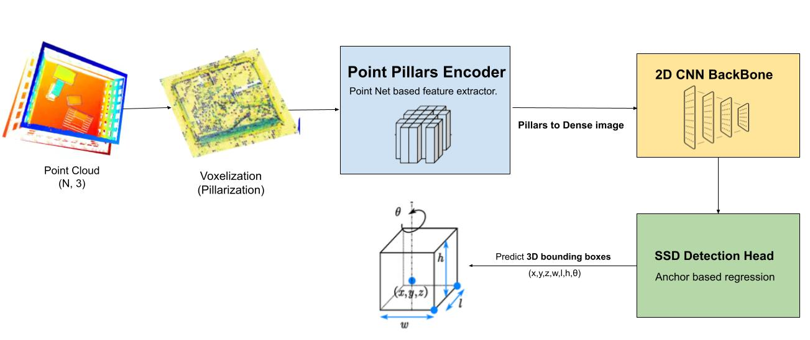 <br>

#### Run the Model Training 


```
    python train_pillars.py --config configs/pillars_config.yaml
```


### 2. Multi-Modal Model (CNN/ViT & PointNet++) 

This model is implemented with the following features:

### Model Pipeline:
 - **Total Parameters:** 
    - ResNet50 + PointNet: **28,476,833**
    - ViT + PointNet: **103,352,417** 
 - **Input: Point Cloud and RGB Image** <br> 
    - Points are retained the raw points without voxelization.normalized to the range [-1, +1], and 100,000 points are sampled from each point cloud.
     - RGB images are normalized to the range [-1, +1], resized to [224, 224], and undergo brightness augmentation.
 - **Image Feature Extraction**
    - CNN-based -> ResNet50
    - Transformer-Based -> Visual Transformer

 - **Point Cloud Features Extraction (PointNet++)**
     - Processes raw point clouds to extract spatial features.
 - **Fusion Network**
    - Combining the extracted features from both the RGB image (CNN output) and the point cloud (PointNet++ output)
 - **MLP Layer and Regression Head**
    - Processes the fused feature vector to predict 3D bounding boxes.
 - **Output: 3D Bounding Box**
    - Multiple 3D bounding boxes using the point cloud and rgb image 

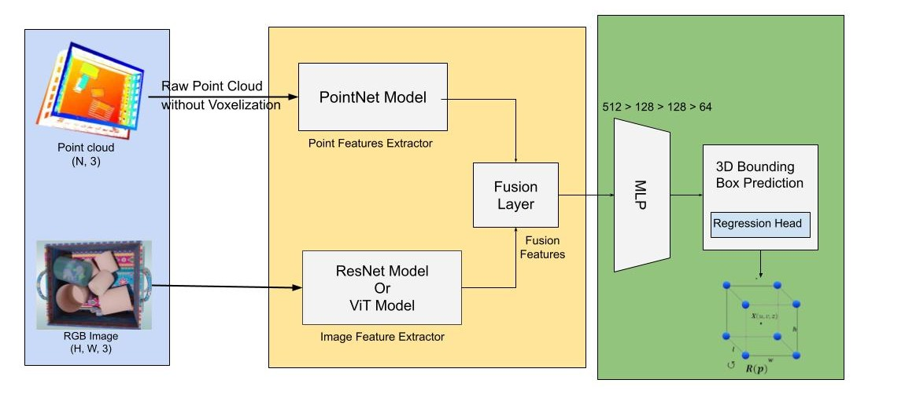 <br>


#### Training Configurations:
```
    Path: configs/multimodal_config.yaml
```
 - Loss Function: **Smooth L1**
 - Optimizer: **AdamW**
 - Learning Rate: **0.0001**
 - Batch Size: **8**
 - Train and Test Sets: **80%, 20% respectively**
 - Image Backbone: **Resnet50 or ViT**
 - Point Backbone: **PointNet++**
 - Epochs: **80**


#### Run the Model Training

```python
python3 train_multimodal.py --config configs/multimodal_config.yaml
```


### 3. Transformer Based Model (3DETR)
This model is implemented with the following features:

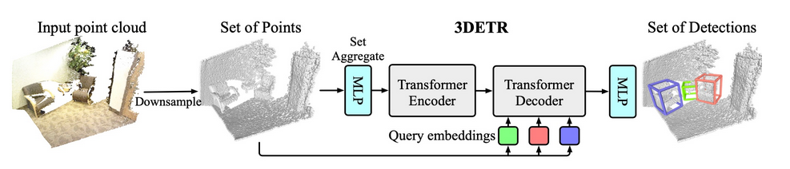 <br>

#### Data preparation for 3DETR
I am following the VoteNet codebase to preprocess data for training 3DETR, using instructions for datasets like SUN RGB-D, and I have customized it accordingly.

```python
python3 data/detr3d_data.py --data_root dataset/sereact_3detr --num_points 100000
```

### Model Pipeline:
 - **Total Parameters: 7,306,976** 
 - **Input: Point Cloud** <br> 
     - it Works directly with **raw point clouds** without requiring voxelization.
 - **Backbone**: 3DETR utilizes a Transformer-based architecture:
    - **Encoder**: Consists of 3 layers, each employing multi-headed attention with four heads and a two-layer MLP with hidden dimensions.
    - **Decoder**: Comprises 8 layers, mirroring the encoder but with MLP hidden dimensions set to 128.
 - **Output:  3D Bounding Box**:
   -  The model predicts 3D bounding boxes corners, means output format is (M, 8, 3)

 - **Inference Time**: PyTorch model running time was 0.10 second or 100 milliseconds 

#### Training Configurations:

 - Loss Function: **Hungarian Loss**
 - Optimizer: **AdamW**
 - Learning Rate: **0.0004**
 - Batch Size: **8**
 - Train and Test Sets: **85%, 15% respectively**
 - Point Backbone: **Transformer**
 - Epochs: **1080**

#### Run the Model Training

```python
python3 train_3detr.py -dataset_name sereact --dataset_root_dir sereact_trainval --max_epoch 1080 --nqueries 256 --base_lr 1e-4 --matcher_giou_cost 3 --matcher_cls_cost 1 --matcher_center_cost 5 --matcher_objectness_cost 5 --loss_giou_weight 0 --loss_no_object_weight 0.1 --save_separate_checkpoint_every_epoch -1 --checkpoint_dir outputs/sereact_ep1080
```

## Performance Evaluation with Smooth L1 Loss:

### 1. PointNet-based model performances

#### Logged by WandB
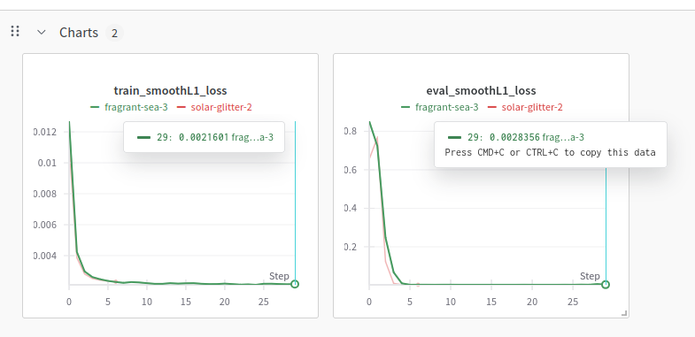 <br>


❗❗❗

***Based on the evaluation, the model is not performing as expected, primarily because the voxelization parameters and the anchor sizes, are not correctly configured. I derived these values from the data distribution using the scripts mentioned above.***

❗❗❗

### 2. MultiModal model performances
#### Logged by WandB

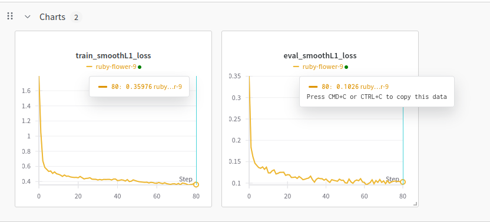 <br>


#### Logged by terminal
```
Epoch 1 
========== Train Loss: 1.7952 
========== Eval Loss: 0.3506
Evaluating: 100%|█████████████████████████████████████████████████████████████████████████████████████████████████████████████████████████████████████████████████| 5/5 [00:00<00:00,  6.66it/s]
Epoch 2 
========== Train Loss: 1.0478 
========== Eval Loss: 0.1832
Evaluating: 100%|█████████████████████████████████████████████████████████████████████████████████████████████████████████████████████████████████████████████████| 5/5 [00:00<00:00,  6.70it/s]
Epoch 3 
..
..
..
Evaluating: 100%|█████████████████████████████████████████████████████████████████████████████████████████████████████████████████████████████████████████████████| 5/5 [00:00<00:00,  6.44it/s]
Epoch 75 

Epoch 78 
========== Train Loss: 0.3594 
========== Eval Loss: 0.1036
Evaluating: 100%|█████████████████████████████████████████████████████████████████████████████████████████████████████████████████████████████████████████████████| 5/5 [00:00<00:00,  6.49it/s]
Epoch 79 
========== Train Loss: 0.3628 
========== Eval Loss: 0.1040
Evaluating: 100%|█████████████████████████████████████████████████████████████████████████████████████████████████████████████████████████████████████████████████| 5/5 [00:00<00:00,  6.50it/s]
Epoch 80 
========== Train Loss: 0.3761 
========== Eval Loss: 0.1031
```

### 3. 3DETR(Transformer) model performances

#### Training results 
 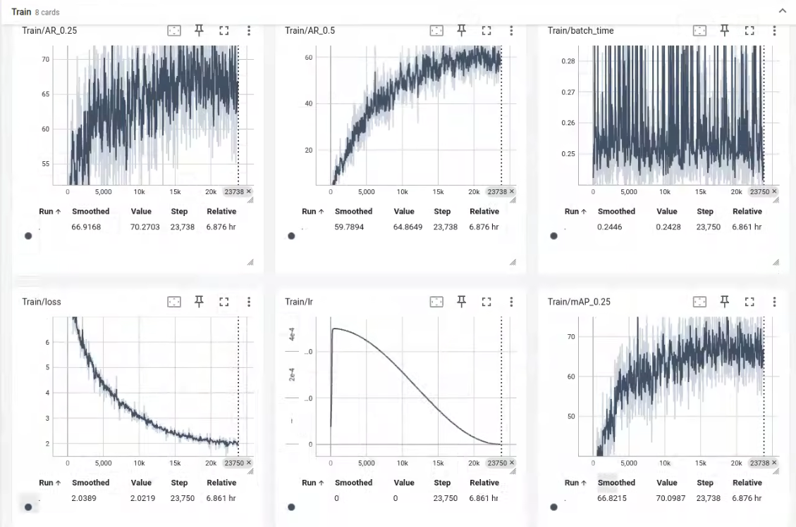 <br>
  - **Train Loss:**, it decreased smoothly which means good training performance but it migth be overfit on training features 
  - **mAP(mean average precision) and AR(average recall) metrics**:
    - mAP at 0.25 and AR at 0.25 are around 70, which indicates the model is doing well in detecting objects during the training. 

#### Testing results 
 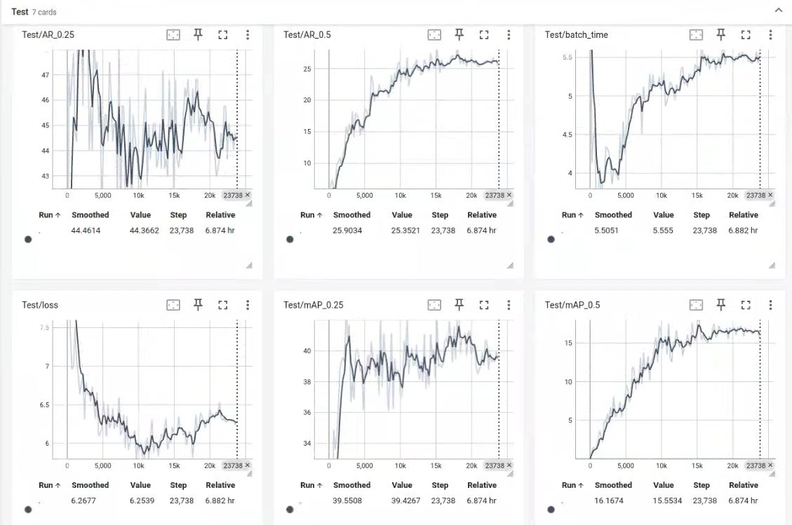 <br>

 - **Test Loss:**, it didn't decrease smoothly, and increase after 10k steps. It might be indicate overfitting.
  - **AP(average precision) and AR(average recall) metrics**:
    - The mAP at 0.25 fluctuates between **38-45**. it doens't improve significantly after 10k steps.
     - AR at 0.25 fluctuates between 40-47.


## Suggestions
 - Use **Point Transformer v2/v3** as point clouds processing backbone to estimate 3D bounding box
 - Fuse Point Transformer with visual backbone (Like CNN Models) to estimate 3D bounding box robustly.
 - Use Transformer-Based 3D object detection like DETR3D, provided by  facebookresearch [Github](https://github.com/facebookresearch/3detr)
 - Use efficeint and accurate CNN backbone for image feature extraction
 - Adopt Point Transform for point cloud processing instead of PointNet
 - Integrate Camera intrinsic parameters for enhance training data prepration
 - Use attention mechanisms for multi-modal feature fusion
 - Using segmentation mask for better 3D object localication 

 ## Problems
  - The provided dataset lacked camera intrinsic parameters.
  - Initially, I attempted to train 3D object detection model using MMDetection, but I encountered issues with CUDA installation and package inconsistencies. After resolving those, I faced another problem with the data loader carshing. Ultimately, I decided to develop my own pipeline.
